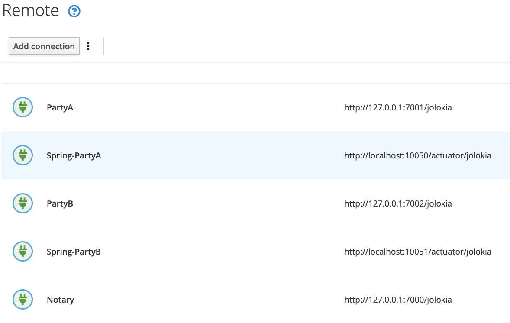

# JMX Monitoring 

## Requirements

1. JDK 1.8 installed. 
2. An environment capable of running basic Unix shell scripts.
3. A relatively modern browser - should work in IE but not tested. 

## Build

```bash
./gradlew clean deployNodes
```

## Cluster startup

Run the following scripts in the given order, each in its own distinct shell:

1. `./scripts/01-Notary-with-jmx.sh`
2. `./scripts/02-PartyA-with-jmx.sh`
3. `./scripts/03-PartyB-with-jmx.sh`
4. `./scripts/04-PartyA-Spring.sh`
5. `./scripts/05-PartyB-Spring.sh`
6. `./scripts/06-start-hawt.sh`

The last script starts the Hawtio app in your system browser.

The first five start the Notary, PartyA and PartyB nodes, and the respective Spring servers all with Jolokia enabled. 

This test Cordapp has a [CustomService](./workflows/src/main/kotlin/com/template/service/CustomService.kt) 
which enumerates the list of legal entities (plural) associated with the node and formats the name
of the respective list of Artemis P2P incoming queues. 

```bash
App has started.
Artemis should have the following queues - one per legal entity of the node:
  O=PartyA, L=London, C=GB: p2p.inbound.DL8zsy3jMfQWCxpvuJsoYjjY6pYVzmt1WUXukrPY61pcun
```

The name of the queue is computed as `p2p.inbound.${party.owningKey.toShortString()`, where
`owningKey` is the public key of the respective legal entity. Please note that a Corda node
can support multiple legal entities, and therefore there will be a queue per entity.

Corda implements this exact naming convention in [ArtemisMessagingComponent#RemoteInboxAddress](https://github.com/corda/corda/blob/release/os/4.8/node-api/src/main/kotlin/net/corda/nodeapi/internal/ArtemisMessagingComponent.kt#L136).
There are a number of other queues that are documented in the [official R3 Corda site](https://docs.r3.com/en/platform/corda/4.8/enterprise/messaging.html#message-queues).
## Hawtio Configuration 

In the `Connect` tab you should see three dots next to the `Add Connection` button.
Clicking it, you should see a menu with the option to import connections: 


Select `Import connections` and choose the file `<project-root>/config/hawtio-connections.json`. 

You should have all the connections listed. 



Open each one in a new tab using the respective `Connect` button.

## Execute A Flow

In the terminal for Party A execute:

```bash
flow start com.template.flows.SimpleTemplateFlow receiver: "O=PartyB, L=New York, C=US"
```

The flow should execute successfully.

```bash
flow start com.template.flows.SimpleTemplateFlow receiver: "O=PartyB, L=New York, C=US"

 ✓ Starting
          Requesting signature by notary service
              Requesting signature by Notary service
              Validating response from Notary service
     ✓ Broadcasting transaction to participants
▶︎ Done

```

## Examining JMX data in Hawtio

In the [Party Artemis Addresses](http://localhost:8080/hawtio/jmx/attributes?con=PartyA&nid=root-org.apache.activemq.artemis-P2P-addresses)
you should see an entry that matches exactly the queue name that [CustomService](./workflows/src/main/kotlin/com/template/service/CustomService.kt#L16)
generated. 

In my local run, PartyA node printed:

```
Artemis should have the following queues - one per legal entity of the node:
  O=PartyA, L=London, C=GB: p2p.inbound.DL8zsy3jMfQWCxpvuJsoYjjY6pYVzmt1WUXukrPY61pcun
```

... and as expected, hawtio has such a queue:


After running the flow, each party node (not notary) should have an `internal.peers.{pubkey}` 
queue bridged (using the AMQP broker) to its counterpart `p2p.incoming.{pubkey}` queue.


## Artemis JMX data

> To be expanded

The [Artemis docs](http://activemq.apache.org/components/artemis/documentation/latest/management)
cover the set of JMX MBeans. There are a few entries that are of interest at least for us:

* `JournalType` - NIO or AIO. On Linux systems this will usually bind to AIO. Earlier versions 
  Artemis [explicitly recommended not using AIO with NFS](https://activemq.apache.org/components/artemis/documentation/1.0.0/persistence.html). 
  The version of Artemis used by Corda (2.6.x) is [apparently ok for AIO to be used with NFSv4](https://activemq.apache.org/components/artemis/documentation/2.6.0/persistence.html).
* `JournalSyncNonTransactional` - this should be set to `true` by default.
* `JournallSyncTransactional` - this should be set to `true` by default.

## Corda Metrics

> To be expanded

The JMX metrics for Corda Enterprise are [documented in version 4.7](https://docs.r3.com/en/platform/corda/4.7/enterprise/node-metrics.html)
but they no longer appear to be in v4.8. 
